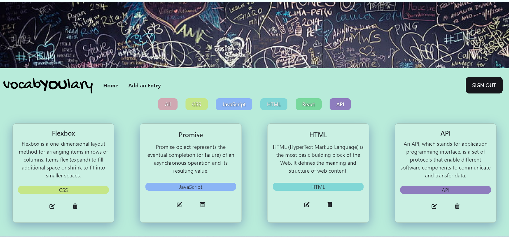

# VocabYOUlary 

VocabYOUlary is an app that helps students stay on top of and demonstrate their learning about important concepts in coding and development.

[View App](https://stellular-praline-eee6df.netlify.app)

## About the User
- Tech students are the ideal users for this app.
- They want to keep track of tech concepts they've learned and make sure they can explain them in their own words.
- VocabYOUlary solves the problem of ensuring comprehension by allowing students to write, update, read and delete their own personal collection of tech terms.

## Features
- When the user lands on the landing page, they sign in with their google account.
- Once signed in, the user only sees the vocabulary they have created.
- When the user adds a vocab entry, a new object is created that is stored to the database and prints to the DOM.
- The user can choose a category (language or technology area) that best describes the entry, which is displayed on the vocab card.
- Category Colors: The color of the category badge is specific to each category.
- Card filtering: Select a category button to only view cards in that category (and again, only cards they have created).
- When the user clicks on the edit button, they can update the entry with new information.
- When the user clicks the delete button, a confirmation window appears, and confirming the delete removes the specific card from the database and re-renders the collection.

## Video Walkthrough of VocabYOUlary
https://www.loom.com/share/829b90d831ea441ba2db6bea724af210

## Relevant Links 
- [Check out the deployed site](https://stellular-praline-eee6df.netlify.app)
- [User flow chart](https://www.figma.com/file/AGKvjYrkqzokECfVBx9P4Y/Vocab-flow?type=whiteboard&node-id=0%3A1&t=6KYQ1YOQsMQ5u61S-1)
- [Wireframe](https://www.figma.com/file/IW4jF3GnzCFLYbEXlgFNIZ/MVP?type=design&node-id=0-1&mode=design&t=kMpLJzS2GQG1LV2w-0)
- [Project Board](https://github.com/users/cnfairall/projects/2)

## Project Screenshots

## Contributors
- [Courtney Fairall](https://github.com/users/cnfairall)
